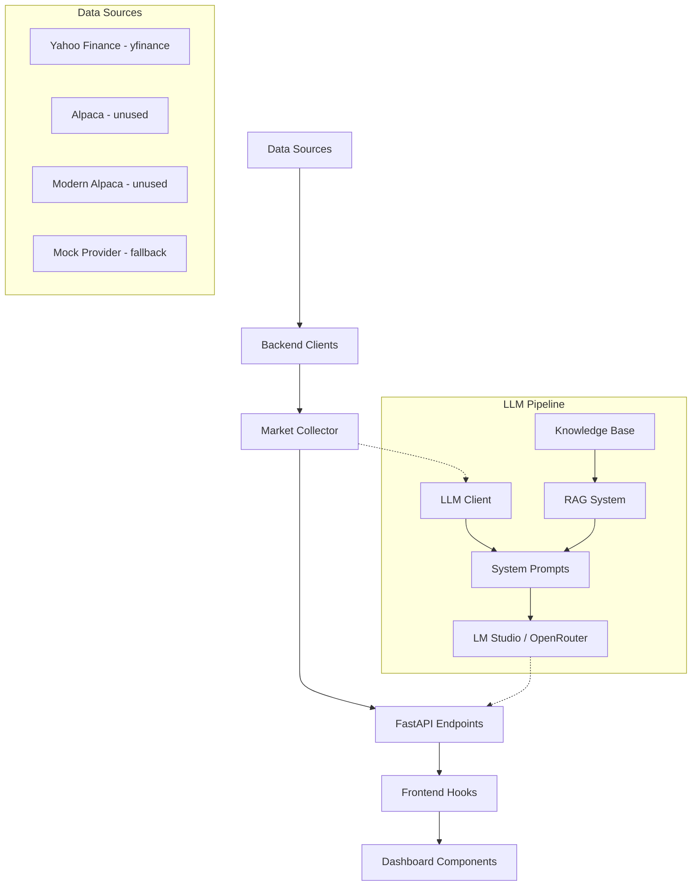

# MarketPulse Comprehensive Architecture & Code Analysis

**Date:** 2026-05-05  
**Analyst:** Architecture Mode  
**Project Version:** 0.1.0 (backend) / 0.2.0 (frontend)

---

## 1. Executive Summary

MarketPulse is a market data dashboard with LLM integration, built with a Python/FastAPI backend and Next.js/React frontend. The project demonstrates an ambitious scope — real-time market data, OHLC technical analysis, LLM-powered market analysis, and a professional trading dashboard — but suffers from significant architectural issues that undermine reliability and maintainability.

### Key Findings at a Glance

| Area | Severity | Summary |
|------|----------|---------|
| **Monolithic API** | 🔴 Critical | [`main.py`](src/api/main.py) is 1,489 lines with 25+ endpoints, duplicate routes, and no router separation |
| **Dead Dashboard Components** | 🔴 Critical | 5 of 7 dashboard components are unused; only [`UnifiedDashboard.tsx`](marketpulse-client/src/components/UnifiedDashboard.tsx) is rendered |
| **Missing API Client Module** | 🔴 Critical | [`useMarketData.ts`](marketpulse-client/src/hooks/useMarketData.ts:3) imports from `@/lib/api` which **does not exist** |
| **Silent Mock Fallback** | 🟡 High | [`market_collector.py`](src/data/market_collector.py:102) silently falls back to outdated mock data without user visibility |
| **Misleading Imports** | 🟡 High | [`market_collector.py`](src/data/market_collector.py:11) imports `YahooFinanceClient as AlpacaClient` |
| **Duplicate Dependencies** | 🟡 High | Both `react-query` v3 and `@tanstack/react-query` v5 in [`package.json`](marketpulse-client/package.json:25) |
| **Sparse Knowledge Base** | 🟡 High | RAG system has only 1 concept doc, 1 hypothesis, and a glossary |
| **No Database Migrations** | 🟠 Medium | Alembic listed in [`requirements.txt`](requirements.txt:6) but no `alembic/` directory exists |
| **Hardcoded URLs** | 🟠 Medium | API URL `http://localhost:8000` hardcoded in multiple frontend components |

### Data Flow Overview



---

## 2. Architecture Issues

### 2.1 Monolithic API File — CRITICAL

**File:** [`src/api/main.py`](src/api/main.py) — 1,489 lines

The entire API is contained in a single file with no router separation. This creates:
- **Maintainability nightmare**: 25+ endpoints, 5 Pydantic models, 2 WebSocket endpoints, and business logic all in one file
- **Merge conflicts**: Multiple developers cannot work on different endpoints simultaneously
- **No separation of concerns**: Data fetching, LLM integration, and HTTP handling are interleaved

**Recommendation:** Split into domain-specific routers:
- `routers/market.py` — market data endpoints
- `routers/llm.py` — LLM chat and analysis endpoints  
- `routers/test.py` — test/debug endpoints
- `routers/websocket.py` — WebSocket endpoints

### 2.2 Duplicate Endpoint Definitions

**File:** [`src/api/main.py`](src/api/main.py)

Two identical routes are defined for the same path and method:

| Route | Method | First Definition | Second Definition |
|-------|--------|-----------------|-------------------|
| `/api/test/data-source` | PUT | [Line 165](src/api/main.py:165) | [Line 230](src/api/main.py:230) |
| `/api/test/yahoo-finance` | PUT | [Line 191](src/api/main.py:191) | [Line 286](src/api/main.py:286) |

FastAPI will only route to the **first** definition, making the second one dead code. The second definitions appear to be improved versions that were never cleaned up.

### 2.3 Three Unused/Redundant Data Source Clients

| Client | File | Status |
|--------|------|---------|
| `AlpacaClient` | [`alpaca_client.py`](src/api/alpaca_client.py) | ❌ Never imported by `main.py` or `market_collector.py` |
| `ModernAlpacaClient` | [`modern_alpaca_client.py`](src/api/modern_alpaca_client.py) | ❌ Never imported anywhere |
| `YahooFinanceClient` | [`yahoo_client.py`](src/api/yahoo_client.py) | ✅ Active — used by `market_collector.py` and `main.py` |

The Alpaca clients represent ~500 lines of dead code. The `alpaca-py` SDK is listed in [`requirements.txt`](requirements.txt:8) but is only used by the unused `ModernAlpacaClient`.

### 2.4 Misleading Import Aliasing

**File:** [`src/data/market_collector.py`](src/data/market_collector.py:11)

```python
from ..api.yahoo_client import YahooFinanceClient as AlpacaClient
```

This imports the Yahoo Finance client but aliases it as `AlpacaClient`, creating confusion for anyone reading the code. The variable `self.alpaca_client` throughout the collector is actually a Yahoo Finance client.

### 2.5 Global Mutable State

**File:** [`src/api/main.py`](src/api/main.py:59)

```python
collector = None
ohlc_analyzer = None
model_cache = {"models": None, "timestamp": None, "cache_duration": 300}
```

Module-level mutable globals are used for shared state. Some endpoints (like [`get_market_internals`](src/api/main.py:341)) create fresh collector instances, while others (like [`get_dashboard_data`](src/api/main.py:377)) use the global. This inconsistency can lead to race conditions under concurrent requests.

### 2.6 No Dependency Injection

There is no DI framework or pattern. Components are instantiated directly with `try/except` blocks at import time ([`main.py` lines 27-57](src/api/main.py:27)). Failed imports set classes to `None`, leading to `None` checks scattered throughout the codebase.

---

## 3. Data Pipeline Issues

### 3.1 Silent Mock Data Fallback — HIGH

**File:** [`src/data/market_collector.py`](src/data/market_collector.py:102)

```python
# Fallback to mock data if API fails
if not internals:
    logger.info("🎭 Using mock market data for testing")
    from ..api.mock_market import mock_provider
    internals = await mock_provider.get_market_internals()
    internals['data_source'] = 'mock'
```

When the Yahoo Finance API fails, the system silently substitutes mock data. The `data_source` field is set to `'mock'` but the frontend does not display this information to the user. This means **users may be making trading decisions based on fake data without knowing it**.

### 3.2 Outdated Mock Data Prices

**File:** [`src/api/mock_market.py`](src/api/mock_market.py:16)

```python
self.base_prices = {
    'SPY': 450.25,    # Current: ~$580+ (as of 2026)
    'QQQ': 375.80,    # Current: ~$500+
    'BTC': 43500,     # Current: ~$90,000+
    'ETH': 2280       # Current: ~$1,800
}
```

Mock prices are from 2023-2024 era. If mock data is served, it will be obviously wrong to any trader.

### 3.3 Symbol Key Inconsistency

The backend has inconsistent symbol key casing:

| Location | SPY key | QQQ key | VIX key |
|----------|---------|---------|---------|
| [`market_collector.py`](src/data/market_collector.py:82) output | `spy` (lowercase) | `qqq` (lowercase) | `vix` (lowercase) |
| [`mock_market.py`](src/api/mock_market.py:53) output | `spy` (lowercase) | `qqq` (lowercase) | — |
| [`main.py` dashboard endpoint](src/api/main.py:381) expects | `spy` (lowercase) | `qqq` (lowercase) | — |
| [`yahoo_client.py`](src/api/yahoo_client.py:150) output | `SPY` (uppercase) | `QQQ` (uppercase) | `^VIX` (with prefix) |
| Frontend [`UnifiedDashboard.tsx`](marketpulse-client/src/components/UnifiedDashboard.tsx:491) | Both cases handled | Both cases handled | Both cases handled |

The [`market_collector.py`](src/data/market_collector.py:78) does lowercase mapping, but the raw Yahoo client returns uppercase. This creates a fragile translation layer.

### 3.4 VIX Symbol Mismatch

**File:** [`src/data/market_collector.py`](src/data/market_collector.py:34)

```python
'VIX': '^VIX',  # Fixed: VIX needs ^ prefix for Yahoo Finance
```

While the comment says "Fixed", the mapping logic at [lines 80-86](src/data/market_collector.py:80) tries both `symbol` and `symbol.replace('^', '')` for lookup, but the Yahoo Finance client returns data keyed by the original symbol `^VIX`, which won't match either lookup.

### 3.5 Inefficient OHLC Data Fetching

**File:** [`src/api/main.py`](src/api/main.py:1273)

The [`get_ohlc_dashboard`](src/api/main.py:1256) endpoint fetches data for 5 symbols × 4 timeframes = **20 separate Yahoo Finance API calls** sequentially. Each call creates a new `YahooFinanceClient` instance:

```python
for symbol in symbols:          # 5 symbols
    for tf_name, tf_config in ohlc_analyzer.timeframes.items():  # 4 timeframes
        client = YahooFinanceClient(settings)  # New instance each time!
        data = client.get_bars(symbol, ...)
```

This is extremely slow and will hit Yahoo Finance rate limits.

### 3.6 No Data Caching

There is no caching layer for market data. Every API request to `/api/market/internals`, `/api/market/dashboard`, etc. triggers a fresh Yahoo Finance API call. With a 60-second frontend refresh interval, this creates unnecessary load.

### 3.7 Market Breadth Is Approximated

**File:** [`src/data/market_breadth.py`](src/data/market_breadth.py:17)

The "market breadth" data uses only 10 NYSE ETFs and 8 NASDAQ ETFs as proxies:

```python
self.nyse_symbols = ['SPY', 'DIA', 'IWM', 'XLF', 'XLE', 'XLV', 'XLI', 'XLK', 'XLY', 'XLP']
self.nasdaq_symbols = ['QQQ', 'ARKK', 'XLK', 'SOXX', 'IBB', 'IWF', 'IWO', 'IWM']
```

Real advance/decline data requires all NYSE/NASDAQ listed stocks. This is a rough proxy at best. The TICK and VOLD calculations are explicitly labeled as "proxies" ([line 177](src/data/market_breadth.py:177)).

### 3.8 No Data Validation Before LLM Injection

Market data is passed directly to the LLM without any validation. Zero prices, missing symbols, or mock data could all be sent to the LLM for analysis, leading to hallucinated or misleading trading advice.

---

## 4. LLM Pipeline Issues

### 4.1 Hardcoded Model Name

The model name `aquif-3.5-max-42b-a3b-i1` is hardcoded in multiple locations:

- [`llm_client.py` line 21](src/llm/llm_client.py:21): `self.model = getattr(self.settings.llm.primary, 'model', 'aquif-3.5-max-42b-a3b-i1')`
- [`main.py` line 653](src/api/main.py:653): `selected_model = getattr(LMStudioClient, 'default_model', 'aquif-3.5-max-42b-a3b-i1')`
- [`main.py` line 799](src/api/main.py:799): Fallback model list
- [`main.py` line 889](src/api/main.py:889): Model status endpoint
- [`llm-chat.tsx` line 74](marketpulse-client/src/components/llm-chat.tsx:74): Frontend default

This model name is not configurable via the YAML config file.

### 4.2 RAG Is Keyword Matching, Not Vector Search

**File:** [`src/llm/trading_knowledge_rag.py`](src/llm/trading_knowledge_rag.py:105)

The "RAG" system is a simple keyword matcher:

```python
def retrieve_context(self, query: str, max_results: int = 5) -> List[Dict[str, Any]]:
    query_lower = query.lower()
    # ... checks for glossary term matches
    # ... checks concept documents for keyword matches
    # ... checks hypothesis documents for matches
```

The relevance scoring at [line 187](src/llm/trading_knowledge_rag.py:187) is just word overlap counting:

```python
matches = sum(1 for word in query_words if word in content_lower)
return matches / len(query_words) if query_words else 0.0
```

This is not semantic search — it will miss synonyms, related concepts, and contextually relevant information.

### 4.3 Sparse Knowledge Base

| Category | Files | Content |
|----------|-------|---------|
| Glossary | 1 JSON file | ~30 terms |
| Core Concepts | 1 markdown file | Market structure only |
| Active Hypotheses | 1 markdown file | Overnight margin cascade |
| Tested Hypotheses | 0 files | Empty directory |

For a trading knowledge system, this is extremely thin. There are no documents on:
- Specific indicator calculations (RSI, MACD, Bollinger Bands)
- Risk management strategies
- Position sizing models
- Market regime identification
- Sector rotation analysis

### 4.4 System Prompt Template Bug

**File:** [`src/llm/system_prompts.py`](src/llm/system_prompts.py:171)

The [`build_enhanced_prompt`](src/llm/system_prompts.py:171) function uses string `.replace()` for template substitution. This is fragile — if `market_data` is `None`, the variable `data_summary` is referenced at [lines 220-229](src/llm/system_prompts.py:220) but only defined inside the `if market_data:` block at [line 206](src/llm/system_prompts.py:206):

```python
data_injection = ""
if market_data:
    import json
    data_summary = json.dumps(market_data, indent=2)  # Only defined here
    ...
# Later:
.replace(
    "{MARKET_DATA}", data_summary if market_data else "No market data provided"
)
```

If `market_data` is `None`, `data_summary` is undefined and will raise a `NameError`.

### 4.5 Missing Import in Enhanced Client

**File:** [`src/llm/enhanced_llm_client.py`](src/llm/enhanced_llm_client.py:254)

The [`validate_data_with_knowledge`](src/llm/enhanced_llm_client.py:212) method uses `re.search` at line 254 but `re` is not imported at the top of the file. This will cause a `NameError` at runtime when JSON parsing of the validation response is attempted.

### 4.6 LLM Not Integrated into Main Data Flow

The enhanced LLM client ([`enhanced_llm_client.py`](src/llm/enhanced_llm_client.py)) and its RAG capabilities are **never used by the main API**. The [`main.py`](src/api/main.py) only imports `LLMManager` and `LMStudioClient` from [`llm_client.py`](src/llm/llm_client.py). The entire enhanced pipeline — knowledge-enhanced analysis, hypothesis testing, chart analysis with context — is dead code.

### 4.7 Token Limits Too Restrictive

| Analysis Type | Max Tokens | Adequate? |
|---------------|-----------|-----------|
| Fast analysis | 150 | ❌ Too short for meaningful analysis |
| Deep analysis | 400 | ⚠️ Marginal for comprehensive analysis |
| Trade review | 250 | ⚠️ Marginal |
| Chat | 500 | ⚠️ Marginal for complex questions |

With only 150 tokens for "fast analysis," the LLM cannot provide substantive market commentary.

---

## 5. Frontend/UI/UX Issues

### 5.1 Seven Dashboard Components — Only One Used — CRITICAL

| Component | File | Lines | Used? | Data Fetching |
|-----------|------|-------|-------|---------------|
| `UnifiedDashboard` | [`UnifiedDashboard.tsx`](marketpulse-client/src/components/UnifiedDashboard.tsx) | 637 | ✅ In [`page.tsx`](marketpulse-client/src/app/page.tsx:4) | Raw `fetch()` |
| `ConnectedMarketDashboard` | [`ConnectedMarketDashboard.tsx`](marketpulse-client/src/components/ConnectedMarketDashboard.tsx) | 402 | ❌ | Raw `fetch()` |
| `EnhancedMarketDashboard` | [`EnhancedMarketDashboard.tsx`](marketpulse-client/src/components/EnhancedMarketDashboard.tsx) | 299 | ❌ (used by `MarketDashboard`) | Props from parent |
| `MarketDashboard` | [`market-dashboard.tsx`](marketpulse-client/src/components/market-dashboard.tsx) | 25 | ❌ | React Query hooks |
| `MacroDashboard` | [`macro-dashboard.tsx`](marketpulse-client/src/components/macro-dashboard.tsx) | 268 | ❌ | React Query hooks |
| `OHLCAnalysisDashboard` | [`ohlc-analysis-dashboard.tsx`](marketpulse-client/src/components/ohlc-analysis-dashboard.tsx) | 475 | ❌ | Raw `fetch()` |
| `LLMChat` | [`llm-chat.tsx`](marketpulse-client/src/components/llm-chat.tsx) | 766 | ✅ Embedded in UnifiedDashboard | Raw `fetch()` |

**~1,470 lines of dead component code.** The evolution appears to be:
1. `ConnectedMarketDashboard` — initial attempt, custom CSS icons
2. `EnhancedMarketDashboard` — refactored UI, accepts props
3. `MarketDashboard` — wrapper using React Query hooks
4. `UnifiedDashboard` — final version combining everything, but reverted to raw `fetch()`

### 5.2 Missing API Client Module — CRITICAL

**File:** [`useMarketData.ts`](marketpulse-client/src/hooks/useMarketData.ts:3)

```typescript
import { marketPulseAPI } from '@/lib/api';
```

The `@/lib/api` module **does not exist** in the project. There is no `src/lib/` directory. This means:
- `useDashboardData`, `useMacroData`, and `useAIAnalysis` hooks **will fail at runtime**
- `MarketDashboard` and `MacroDashboard` components (which use these hooks) cannot work
- Only `UnifiedDashboard` works because it uses raw `fetch()` calls directly

### 5.3 Hardcoded API URLs

**File:** [`UnifiedDashboard.tsx`](marketpulse-client/src/components/UnifiedDashboard.tsx:87)

```typescript
const [dashboardResponse, macroResponse, breadthResponse] = await Promise.all([
    fetch('http://localhost:8000/api/market/dashboard'),
    fetch('http://localhost:8000/api/market/macro'),
    fetch('http://localhost:8000/api/market/breadth')
]);
```

Also in [`ConnectedMarketDashboard.tsx`](marketpulse-client/src/components/ConnectedMarketDashboard.tsx:88), [`ohlc-analysis-dashboard.tsx`](marketpulse-client/src/components/ohlc-analysis-dashboard.tsx), and [`llm-chat.tsx`](marketpulse-client/src/components/llm-chat.tsx).

The `NEXT_PUBLIC_API_URL` environment variable defined in [`docker-compose.yml`](docker-compose.yml:38) is never used by any component.

### 5.4 Custom Icons Instead of Lucide

**Files:** [`ConnectedMarketDashboard.tsx`](marketpulse-client/src/components/ConnectedMarketDashboard.tsx:6), [`ohlc-analysis-dashboard.tsx`](marketpulse-client/src/components/ohlc-analysis-dashboard.tsx:6)

Several components define custom CSS-based icon components:

```typescript
const ActivityIcon = () => (
    <div className="w-4 h-4 bg-blue-400 rounded-full" />
);
```

Meanwhile, `lucide-react` is already a project dependency and is properly used in [`UnifiedDashboard.tsx`](marketpulse-client/src/components/UnifiedDashboard.tsx:7) and [`macro-dashboard.tsx`](marketpulse-client/src/components/macro-dashboard.tsx:4). This inconsistency suggests components were written at different times without coordination.

### 5.5 Fake Sparkline Data

**File:** [`UnifiedDashboard.tsx`](marketpulse-client/src/components/UnifiedDashboard.tsx:168)

```typescript
const generateSparklineData = (currentPrice: number, change: number): number[] => {
    // ...
    const noise = (Math.random() - 0.5) * priceRange * 0.2; // 20% noise
    data.push(baseValue + noise);
    // ...
};
```

Sparkline charts display randomly generated data, not actual historical prices. This is misleading — users see a "trend line" that is entirely fabricated.

### 5.6 Duplicate React Query Packages

**File:** [`package.json`](marketpulse-client/package.json:25)

```json
"react-query": "^3.39.3",           // Legacy package
"@tanstack/react-query-devtools": "^5.90.2",  // v5 devtools
```

The hooks file imports from `@tanstack/react-query` (v5, via the devtools dependency), but the legacy `react-query` v3 is also installed. This creates confusion about which API to use.

### 5.7 Zustand Installed But Unused

**File:** [`package.json`](marketpulse-client/package.json:28)

`zustand` is listed as a dependency but is never imported or used anywhere in the codebase. All state management is done via `useState` or React Query.

### 5.8 Case Sensitivity Mismatch Between Backend and Frontend

The backend returns snake_case keys (`change_pct`, `volume_flow`, `market_bias`), but the TypeScript types in [`market.ts`](marketpulse-client/src/types/market.ts) define camelCase (`changePct`, `volumeFlow`, `marketBias`). The `UnifiedDashboard` works around this by redefining interfaces locally with snake_case, but the shared types file is misaligned.

### 5.9 No Loading Skeletons or Error Boundaries

Only [`UnifiedDashboard.tsx`](marketpulse-client/src/components/UnifiedDashboard.tsx:444) has a basic loading spinner. There are:
- No React error boundaries
- No skeleton loading states for individual sections
- No retry UI for failed API calls
- No offline detection or handling

---

## 6. Backend/API Issues

### 6.1 Missing Database Methods

**File:** [`src/api/main.py`](src/api/main.py:1026)

The [`add_user_comment`](src/api/main.py:1014) endpoint calls `db_manager.save_user_comment(comment_data)` at line 1026, but the [`DatabaseManager`](src/core/database.py:108) class has no `save_user_comment` method.

Similarly, [`get_conversation_history`](src/api/main.py:1177) calls `db_manager.get_analysis_conversation(analysis_id)` at line 1182, which also does not exist.

These endpoints will fail with `AttributeError` at runtime.

### 6.2 No Request Validation on Key Endpoints

Several endpoints accept unvalidated input:

- [`test_data_source`](src/api/main.py:230): Accepts `Dict[str, Any]` with no validation
- [`websocket_endpoint`](src/api/main.py:920): No message validation
- OHLC endpoints have no symbol validation (could receive SQL injection strings)

### 6.3 No Rate Limiting or Authentication

The API has:
- No API key validation
- No rate limiting
- No CORS restriction for production (allows `localhost:3000` and `localhost:3001` only, but no production origins)
- No request size limits

### 6.4 Bare Except Clauses

Throughout the codebase, bare `except:` clauses catch and silently discard errors:

- [`market_collector.py` line 146](src/data/market_collector.py:146): `except: return None`
- [`market_collector.py` line 157](src/data/market_collector.py:157): `except: return None`
- [`market_collector.py` line 174](src/data/market_collector.py:174): `except: return "UNKNOWN"`
- [`main.py` line 535](src/api/main.py:535): `except:` with no error variable

These make debugging nearly impossible.

### 6.5 Database Session Management

**File:** [`src/core/database.py`](src/core/database.py:135)

The `DatabaseManager` manually opens and closes sessions:

```python
def save_price_data(self, symbol: str, timeframe: str, data_list: list):
    session = self.get_session()
    try:
        # ... operations ...
        session.commit()
    except Exception as e:
        session.rollback()
        raise e
    finally:
        session.close()
```

This pattern is repeated for every method. A context manager pattern would be safer and more Pythonic. Sessions are not thread-safe, and concurrent requests could share sessions incorrectly.

### 6.6 Docker Configuration Issues

**File:** [`Dockerfile.api`](Dockerfile.api:13)

```dockerfile
COPY requirements-lite.txt requirements.txt
```

The file `requirements-lite.txt` does not exist in the project. The Docker build will fail.

**File:** [`docker-compose.yml`](docker-compose.yml:11)

```yaml
environment:
    - DATABASE_URL=sqlite:///./marketpulse.db  # Default to SQLite
```

The Docker compose defaults to SQLite, but [`config.py`](src/core/config.py:305) generates a PostgreSQL URL. The `DATABASE_URL` environment variable is never read by the Settings class, which constructs its own URL from individual fields.

### 6.7 No Database Migration System

Alembic is listed in [`requirements.txt`](requirements.txt:6) but there is no `alembic.ini` or `alembic/` directory. The SQL schema in [`database/01-create-tables.sql`](database/01-create-tables.sql) uses schemas (`market_data.`, `analysis.`) that are not created by any init script. The SQLAlchemy models in [`database.py`](src/core/database.py:11) don't specify schemas, creating a mismatch.

### 6.8 OHLC Analysis Creates YahooFinanceClient Per Timeframe

**File:** [`src/api/main.py`](src/api/main.py:1212)

```python
for tf_name, tf_config in ohlc_analyzer.timeframes.items():
    from src.api.yahoo_client import YahooFinanceClient
    client = YahooFinanceClient(settings)  # New instance per iteration!
    data = client.get_bars(symbol, tf_config['period'], ...)
```

The import is inside the loop, and a new client instance is created for every timeframe. This should be created once outside the loop.

---

## 7. Specific Recommendations

### Priority 1 — Critical Fixes

| # | Issue | Recommendation | Rationale |
|---|-------|----------------|-----------|
| 1 | Missing `@/lib/api` module | Create the API client module or remove hooks that depend on it | Runtime crash for any component using React Query hooks |
| 2 | Duplicate endpoint definitions | Remove duplicate routes at [lines 230-284](src/api/main.py:230) and [lines 286-333](src/api/main.py:286) | Ambiguous routing, dead code |
| 3 | Silent mock fallback | Add a visible banner in the frontend when `data_source === 'mock'` | Users must know when they see fake data |
| 4 | Missing DB methods | Implement `save_user_comment` and `get_analysis_conversation` on `DatabaseManager` | Runtime `AttributeError` on those endpoints |
| 5 | `data_summary` NameError | Fix the variable scoping in [`build_enhanced_prompt`](src/llm/system_prompts.py:171) | Crash when `market_data` is None |
| 6 | Missing `requirements-lite.txt` | Create the file or update Dockerfile to use `requirements.txt` | Docker build failure |

### Priority 2 — Architecture Improvements

| # | Issue | Recommendation | Rationale |
|---|-------|----------------|-----------|
| 7 | Monolithic `main.py` | Split into FastAPI routers by domain | Maintainability, team collaboration |
| 8 | Dead dashboard components | Remove 5 unused components or extract reusable pieces | ~1,470 lines of dead code |
| 9 | Misleading import alias | Rename `AlpacaClient` import to `YahooFinanceClient` in `market_collector.py` | Code readability |
| 10 | Dead data source clients | Remove or properly integrate `alpaca_client.py` and `modern_alpaca_client.py` | ~500 lines of dead code |
| 11 | Dead LLM pipeline | Integrate `EnhancedLMStudioClient` and RAG into the main API flow | The knowledge-enhanced analysis is never used |
| 12 | Hardcoded API URLs | Use `NEXT_PUBLIC_API_URL` environment variable consistently | Required for Docker/deployment |

### Priority 3 — Data Quality

| # | Issue | Recommendation | Rationale |
|---|-------|----------------|-----------|
| 13 | Update mock prices | Update to current market levels or fetch from a fallback API | Obvious fake data undermines trust |
| 14 | Add data caching | Implement Redis or in-memory caching with TTL | Reduce API calls, improve response times |
| 15 | Batch OHLC requests | Create one `YahooFinanceClient` and batch requests | 20 sequential calls is too slow |
| 16 | Add data validation | Validate prices, volumes, and timestamps before serving | Prevent bad data from reaching LLM and users |
| 17 | Fix symbol casing | Standardize on one convention throughout the stack | Prevents data lookup failures |

### Priority 4 — LLM Pipeline

| # | Issue | Recommendation | Rationale |
|---|-------|----------------|-----------|
| 18 | Expand knowledge base | Add docs for indicators, risk management, strategies | RAG is only as good as its knowledge |
| 19 | Upgrade RAG to vector search | Use sentence embeddings for semantic retrieval | Keyword matching misses related concepts |
| 20 | Make model configurable | Add model name to YAML config | Remove hardcoded model references |
| 21 | Increase token limits | Fast: 300, Deep: 800, Chat: 1000 | Current limits are too restrictive |
| 22 | Add streaming responses | Implement SSE for LLM chat | Better UX for long responses |

### Priority 5 — Frontend Quality

| # | Issue | Recommendation | Rationale |
|---|-------|----------------|-----------|
| 23 | Remove duplicate React Query | Uninstall `react-query` v3, keep only `@tanstack/react-query` v5 | Package confusion |
| 24 | Remove unused Zustand | Uninstall if not needed | Dead dependency |
| 25 | Use real historical data for sparklines | Fetch from `/api/market/historical` endpoint | Current sparklines are fabricated |
| 26 | Add error boundaries | Wrap dashboard sections in React error boundaries | Graceful degradation |
| 27 | Unify icon usage | Use `lucide-react` consistently across all components | Code consistency |

---

## Appendix A: File Statistics

| Category | Files | Total Lines |
|----------|-------|-------------|
| Backend API | 6 | ~2,900 |
| Backend Core | 2 | ~550 |
| Backend Data | 2 | ~800 |
| Backend Analysis | 1 | ~754 |
| Backend LLM | 5 | ~1,800 |
| Frontend Components | 9 | ~3,100 |
| Frontend Hooks | 2 | ~180 |
| Frontend Types | 1 | ~63 |
| Database SQL | 3 | ~125 |
| Config/Infra | 6 | ~500 |
| **Total** | **~37** | **~10,800** |

## Appendix B: Dependency Analysis

### Backend ([`requirements.txt`](requirements.txt))

| Package | Used? | Notes |
|---------|-------|-------|
| `fastapi` | ✅ | Core framework |
| `uvicorn` | ✅ | ASGI server |
| `psycopg` | ⚠️ | Listed but SQLite used in dev |
| `sqlalchemy` | ✅ | ORM |
| `alembic` | ❌ | Listed but no migration setup |
| `alpaca-trade-api` | ❌ | Old SDK, `modern_alpaca_client.py` uses `alpaca-py` instead |
| `python-binance` | ❌ | Never imported anywhere |
| `openai` | ❌ | Never imported; uses `aiohttp` directly for LM Studio |
| `yfinance` | ✅ | Primary data source (not in requirements.txt!) |

**Critical:** `yfinance` is the actual data source but is **not listed in requirements.txt**. It must be installed separately or the application will fail.

### Frontend ([`package.json`](marketpulse-client/package.json))

| Package | Used? | Notes |
|---------|-------|-------|
| `next` | ✅ | Framework |
| `react-query` | ❌ | Legacy v3, conflicts with v5 |
| `@tanstack/react-query-devtools` | ✅ | Used for QueryProvider |
| `framer-motion` | ✅ | Animations |
| `lucide-react` | ⚠️ | Used in some components, not all |
| `recharts` | ❌ | Never imported |
| `zustand` | ❌ | Never imported |
| `@headlessui/react` | ❌ | Never imported |
| `@heroicons/react` | ❌ | Never imported |
| `date-fns` | ❌ | Never imported |

~6 unused frontend dependencies adding bloat to `node_modules`.
